# Set Cover 多算法理论与实验比较分析报告（基于 batch_20260222_231920_749068）

## 摘要

集合覆盖问题（Set Cover Problem, SCP）是经典 NP-hard 组合优化问题。在工程场景中，我们往往既希望“成本尽量低”，又希望“解足够稳健”：一旦某些集合不可用（失效、被删、资源临时不可调度），覆盖可能会瞬间崩塌。基于这一现实需求，本报告对同一组 SCP 实例进行多算法系统比较，目标是回答两个问题：

1. 在不同类型实例上，哪些算法更适合“成本最小化”的常规单目标任务？
2. 当需要考虑“抗损性/稳健性”时，多目标方法应如何参与决策？

实验层面，我们在同一批次数据上运行了 6 个算法（ILP、贪心、SA、GA、HGASA、NSGA-II），并据此筛选形成最终报告主线：`ilp_pulp + greedy_001 + ga + moea_nsga2`。其中 `ilp_pulp` 提供最优参考，`greedy_001` 提供超快基线，`ga` 作为最终单目标启发式代表；`moea_nsga2` 则用于“成本-抗损性”联合决策（帕累托前沿）。

数据层面，本批次构造了 8 类实例，用“单变量控制”的方式分别考察 set 规模、item 规模、稠密度与特殊结构（hub/clustered）对算法表现的影响。评价指标覆盖运行时间、相对 ILP 最优差距（gap）、收敛与稳定性、显著性检验（Wilcoxon）以及 log-log 复杂度拟合。总体结论是：ILP 在该规模下可稳定求得最优；贪心速度最优但质量受限；SA 在本批次中速度快但质量明显落后；GA 与 HGASA 在质量上互有胜负且差异不显著，但 HGASA 的额外开销较大，因此主线启发式最终固定为 GA；对于“抗损性”需求，应避免把 NSGA-II 简化为单个最小成本代表点，而应采用“抗损阈值筛选 + 最小成本”的口径选解。

## 0. 复现信息

- 实验批次：`outputs/experiments/batch_20260222_231920_749068`
- 汇总结果：`outputs/experiments/batch_20260222_231920_749068/runs/analysis/results`
- 图像来源：`outputs/experiments/batch_20260222_231920_749068/runs/analysis/figures`
- 本报告图片拷贝目录：`report/figures`

参考的 source 文档（用于复用问题定义、理论分析框架和术语）：
- `source/ilp/Set Cover 问题整数规划算法.docx`
- `source/greedy/报告.docx`
- `source/meta/元启发式算法解决set cover.docx`
- `source/cuttingedge/MOEAs算法性能评估报告.docx`

---

## 1. 问题定义与算法选型

### 1.1 问题定义

集合覆盖问题（Set Cover Problem, SCP）可以理解为：我们有一堆“可选的资源/动作”（集合），每个集合能覆盖一部分需求（元素），同时每个集合有成本。希望用尽可能小的成本选出一些集合，把所有元素都覆盖到至少一次。其形式化定义如下：

给定元素全集 $U=\{e_1,\dots,e_n\}$ 和集合族 $S=\{S_1,\dots,S_m\}$，每个集合 $S_j$ 有成本 $c_j$。
目标是在满足覆盖约束的前提下，最小化总成本：

$$
\min \sum_{j=1}^{m} c_j x_j
$$

$$
\text{s.t. } \sum_{j:e_i\in S_j} x_j \ge 1,\ \forall i=1,\dots,n, \quad x_j\in\{0,1\}
$$

该问题是 NP-hard，在设施选址、监测点布设、资源调度等场景有直接应用价值。实际业务里，除了“成本低”，还经常关心“解的冗余度/稳健性”：如果很多元素只被覆盖一次，那么一旦某个关键集合失效，覆盖会大面积破坏，这正是本报告引入多目标 NSGA-II（成本 + 抗损性代理指标）的主要动机之一。

### 1.2 算法选型与动机

为满足课程“至少三类性质不同算法”的要求，并且让结论更贴近工程决策，本批次先运行 6 个算法用于筛选和对照，最终在报告主线中固定为 4 个算法（其余作为候选与机理分析的补充材料）：

1. 经典常规算法（主线）：
- `ilp_pulp`：精确最优参考（质量上界）
- `greedy_001`：超快工程基线（时间下界）

2. 元启发算法（主线，仅保留一个）：
- `ga`：作为最终单目标启发式代表

3. 多目标算法（特殊分支）：
- `moea_nsga2`：用于“成本-抗损性”联合决策（帕累托前沿），不与单目标算法做完全同口径硬比

4. 预筛选算法（不进入最终主表）：
- `sa`、`hgasa` 作为候选启发式用于前期筛选与机理分析

最终采用该主线的动机可以概括为：

- **基线可验证**：`ilp_pulp` 提供最优解参考，使得“gap”有明确意义；
- **速度下界明确**：`greedy_001` 基本给出“能有多快”的下界；
- **启发式可部署**：`ga` 在本批次中与 `hgasa` 的质量差异不显著，但运行开销显著更低，且实现与调参负担更小，因此作为唯一主推启发式更合理；
- **稳健性可表达**：`moea_nsga2` 将“抗损性”显式写入目标，适合在存在失效风险的场景里做折中决策。

换句话说：主线报告回答“常规单目标怎么选”，NSGA-II 章节回答“当稳健性变成硬约束时怎么选”。

---

## 2. 理论分析（复杂度、保证与瓶颈）

集合覆盖是 NP-hard，理论上不存在通用的多项式时间精确算法（除非 P=NP）。因此本节的重点不是“谁一定更快”，而是把不同范式的算法放在同一坐标系下理解：

- 精确法（ILP）靠剪枝与下界强度“赌”实例结构，最好时很快，最坏时指数爆炸；
- 贪心法用近似保证换速度，通常能瞬间给出可行解，但很难再回头修正早期选择；
- 元启发式（GA/SA/HGASA）用随机搜索换“可扩展性”，其时间更多由预算（代数/迭代次数、种群大小）和评估代价决定；
- 多目标（NSGA-II）解决的不是“单个最好解”，而是“不同权衡下的一组候选解”。
下面的表格给出每种算法的复杂度骨架、保证与瓶颈，便于后续把实验现象对回理论预期。

| 算法 | 时间复杂度（主导项） | 空间复杂度 | 性能保证 | 关键瓶颈 |
|---|---:|---:|---|---|
| ILP (`ilp_pulp`) | 最坏指数级（B&B 树） | 约 $O(nm)$+节点存储 | 若求解到 optimal 则全局最优；超时可给 gap | 分支节点爆炸、松弛强度、对称性 |
| 贪心 (`greedy_001`) | 常见实现约 $O(m^2 n)$（逐轮重评估） | $O(n+m)$ | 经典集合覆盖有 $H_n$ 近似界 | 局部决策不可回溯 |
| SA (`sa`) | $O(I\cdot C_{nb})$ | $O(m)$ | 对数降温下有理论收敛性质 | 温度/邻域参数敏感 |
| GA (`ga`) | $O(G\cdot P\cdot C_{fit})$ | $O(Pm)$ | 无严格近似比；依赖种群多样性 | 早熟收敛、评估开销 |
| HGASA (`hgasa`) | $O(G\cdot P\cdot C_{fit}+K\cdot C_{SA-local})$ | $O(Pm)$+SA额外开销 | 实务上通常优于纯 GA/SA | 混合频率与局部搜索代价 |
| NSGA-II (`moea_nsga2`) | $O(T\cdot(MN^2+ND))$ | $O(ND+NM)$ | 渐近逼近帕累托前沿（多目标） | 非支配排序 $N^2$ 主导 |

补充说明（结合本仓库实现）：

- **ILP**：使用 PuLP 调用 CBC；当达到 `optimal` 时解为全局最优；若触发时间上限，理论上可返回“上界 + 下界 + gap”。本批次实际全部达到 `optimal`（见第 6 节结论）。
- **Greedy**：采用“单位成本覆盖新增元素数最大化”的经典策略（`source/greedy` 同款思想），优点是极快、稳，缺点是早期选择不可回溯，遇到结构性陷阱时会被锁死。
- **GA/HGASA/SA**：均为位向量（选/不选集合）表示，且带有 `repair`（修复）以保证可行解；因此“可行率”在本批次里不构成主要差异，差异主要体现在质量与时间预算上。
- **NSGA-II**：本项目的第二目标是 `vulnerability = 单覆盖元素数`（越小越稳健），并且记录了帕累托前沿点集。需要强调的是：日志中的 `objective` 默认仍是“可行解中最小成本代表点”，而报告讨论抗损性时应该按阈值规则在前沿上选解（见第 4.8 节）。

---

## 3. 实验设计

### 3.1 数据集构成

本实验的核心是“把输入特征拆开来观察”。如果同时改变 set 数、item 数和密度，最终看到的差异很容易混在一起，难以解释。因此本批次按控制变量构造 8 类实例，分别突出四个维度：

- **set 规模类**：仅改变 `set_count`，其余（item_count、density、结构）固定，用来观察“候选集合数量”变大后各算法的时间增长与质量变化。
- **item 规模类**：仅改变 `item_count`，其余固定，用来观察“覆盖元素规模”变大后算法的行为。
- **稀疏/稠密类**：固定规模，仅改变 `density`，用于验证“约束强/弱”对 ILP 剪枝、以及对启发式搜索空间的影响。
- **结构类**：固定规模与密度，仅改变生成结构，用来观察“非随机结构”是否更利于搜索（或更容易产生对称性/陷阱）。

其中 `density` 可理解为集合-元素关联矩阵中非零项占比（平均覆盖概率）；`special_clustered` 表示集合更倾向覆盖同一簇元素，`special_hub` 表示少量 hub 元素更可能出现在大量集合中（更贴近“关键节点/关键需求”的场景）。

本批次各类实例参数范围如下（每类 10 个不同实例）：

| class_id | n_instances | set_count | item_count | density |
|---|---:|---:|---:|---:|
| set_scale_small | 10 | 20~220 | 120 | 0.065 左右 |
| set_scale_large | 10 | 400~600 | 280 | 0.065 |
| item_scale_small | 10 | 220 | 60~240 | 0.065 |
| item_scale_large | 10 | 520 | 160~420 | 0.065 |
| low_density | 10 | 300 | 220 | 0.01~0.05 |
| high_density | 10 | 300 | 220 | 0.08~0.10 |
| special_clustered | 10 | 300 | 220 | 0.065 |
| special_hub | 10 | 300 | 220 | 0.065 |

运行次数方面：每个算法每类共有 20 条运行记录（10 实例 × 2 repeats），总计 960 条。需要注意的是，这里“20 条记录”不等价于“20 个不同实例”；严格满足课程要求（每类≥20 个样本、随机重复≥5）时，应将 **每类实例数提升到 ≥20**，并把 **repeats 提升到 ≥5**。本报告将该批次视为一轮预实验，用于确认趋势、暴露问题与确定主线算法组合。

### 3.2 参数与运行设置（节选）

为保证对比的可解释性，本批次不做大规模参数调优，而是固定一组“可运行、可复现”的基准参数（详见批次 `manifest.csv`）。直觉上我们希望各算法预算尽量对齐，但不同范式的预算单位并不完全等价（例如 SA 的一次迭代与 GA 的一代并不是同样的工作量），因此这里更强调“固定预算 + 记录真实运行时间”，再用图表与拟合去观察增长趋势。

- `ilp_pulp`：`time_limit_sec=60`, `msg=0`（设置求解上限，避免极端样本拖垮实验）
- `sa`：`max_iter=50000`, `early_stop_patience=0`（固定迭代上限，不早停）
- `ga/hgasa`：`generations=450`, `early_stop_patience=0`（固定代数上限，不早停）
- `moea_nsga2`：`generations=100`, `early_stop_patience=20`（多目标前沿较昂贵，先用较小代数做预评估）

从“报告主线”角度看：`sa/hgasa` 在此阶段的作用是帮助我们理解启发式机制与做候选筛选，最终仍以 `ga` 作为单目标启发式代表。

### 3.3 评估指标

本报告采用“效率 + 质量 + 稳健性”三条主线指标，并补充统计检验与复杂度拟合：

- **运行时间**：`runtime_sec`（墙钟时间，越小越好）。
- **解质量**：`gap_to_ilp_opt_pct`（相对 ILP 最优差距，越小越好）。当 ILP 能求到最优时，gap 具有明确含义；若 ILP 未来在更大规模上超时，则应改用“最优性间隙（上界-下界）”或“与最好已知解比较”的口径。
- **稳定性/收敛**：使用 `convergence_curve`（收敛轨迹）与 `convergence_speed_mean`（达到最终改进 95% 所需步数）描述“收敛速度”；使用 `stability_var_mean` 描述“同一实例重复运行时 objective 的方差”（方差越小越稳定）。
- **显著性统计**：对同一实例的成对结果做 Wilcoxon 检验（见 `significance_algo.csv`），用于区分“看起来更好”和“统计上稳定更好”。
- **理论一致性**：对 log-log 坐标下的时间增长趋势做线性拟合（见 `complexity_fit.csv`），用于验证理论复杂度与实际测得趋势是否一致。

注：课程要求建议“随机实验重复 >=5 次”。本批次为 repeats=2，更接近预实验；结论可用，但统计置信度仍可继续增强。

---

## 4. 数据分析与可视化

### 4.1 运行时间对比

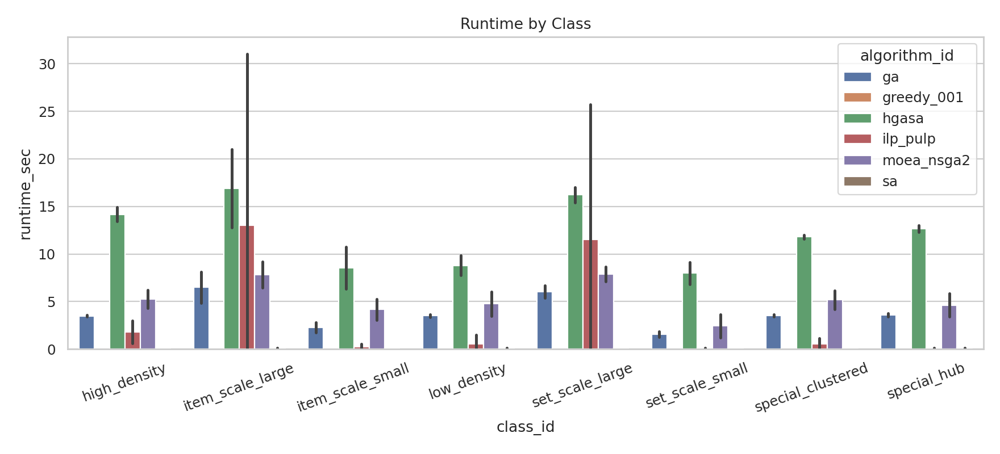
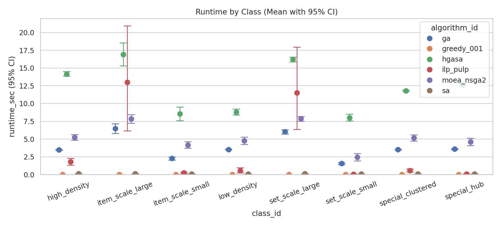

我们先从“时间”入手，因为时间往往决定算法能不能在真实系统里落地。图中柱状图给出各算法在不同类别上的平均运行时间，CI 图给出均值的不确定性区间（本批次 repeats=2，因此 CI 仅作为参考）。

全局平均运行时间（越小越好）：

| 算法 | runtime_mean(s) |
|---|---:|
| greedy_001 | 0.0122 |
| sa | 0.0961 |
| ilp_pulp | 3.4823 |
| ga | 3.8128 |
| moea_nsga2 | 5.2663 |
| hgasa | 12.1361 |

从结果可以得到几个非常直观、也符合直觉的结论：

1. `greedy_001` 几乎在所有类别都保持毫秒级速度，它给出的是“能有多快”的基线。缺点也很典型：它把大量决策压在前几步贪心上，一旦前几步走偏，后面很难修正（对应质量部分的 gap）。
2. `sa` 在本批次中运行也非常快（0.1s 量级），这与 SA “单解 + 简单邻域采样” 的特征一致；但它的主要问题不在时间而在质量（见 4.2）。
3. `ga` 与 `hgasa` 的时间差距非常明显：HGASA 通过嵌入局部搜索（SA local search）强化质量，但代价是每代/每个体的开销显著增加，因此整体时间更长。
4. `ilp_pulp` 在该规模下多数样本能较快求解，但方差明显：少数样本会接近 60s 上限（本批次 160 次 ILP 运行中有 2 次接近上限），符合分支定界“最好很快、最坏很慢”的典型行为。

### 4.2 解质量（相对 ILP）

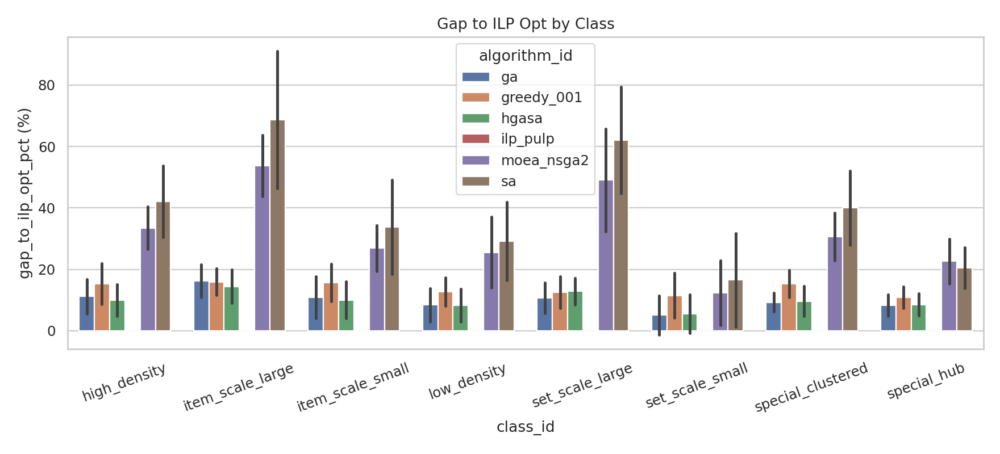
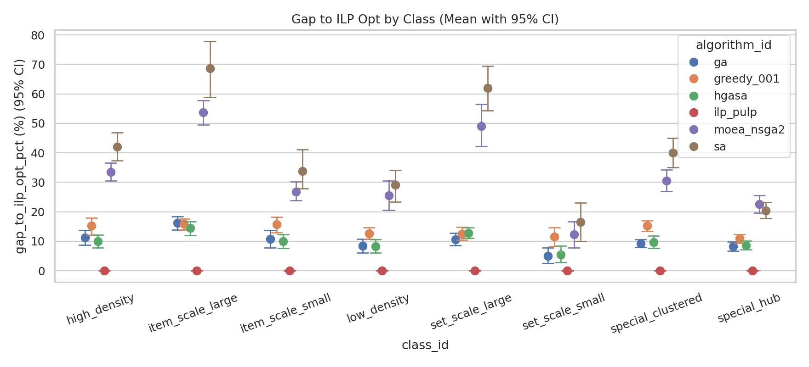

解质量采用 `gap_to_ilp_opt_pct`：把某算法的成本与 ILP 最优成本做相对差值。因为本批次 ILP 全部达到 `optimal`，所以 gap 的参考点是可靠的。需要提醒的是：当未来规模继续增大、ILP 可能超时或只能给出上下界时，gap 的定义需要切换成“与最好已知可行解”或“最优性间隙”的口径。

全局平均 gap（越小越好）：

| 算法 | gap_mean(%) |
|---|---:|
| ilp_pulp | 0.0000 |
| hgasa | 9.9093 |
| ga | 9.9877 |
| greedy_001 | 13.7030 |
| moea_nsga2 | 31.7690 |
| sa | 39.0746 |

从全局均值可以先得到一个“粗粒度排序”：`ilp_pulp`（0%） < `ga/hgasa`（约 10%） < `greedy_001`（约 14%） < `moea_nsga2`（约 32%） < `sa`（约 39%）。但这只是平均意义上的结论，真正有价值的是“不同类别是否存在不同优势算法”，因为这能支持你在报告里做出“适用边界”的总结。

本批次里，候选启发式之间确实出现了明显的“类别分工”。下面的优势区间统计不含 ILP（它在质量上永远最优）也不含 NSGA（它需要按阈值口径选解），仅比较 `ga/hgasa/sa/greedy`：

- `hgasa` 更优：`high_density`, `item_scale_large`, `item_scale_small`, `low_density`
- `ga` 更优：`set_scale_large`, `set_scale_small`, `special_clustered`, `special_hub`

这说明“不同类别数据有不同优势算法”在质量维度上是成立的（GA 与 HGASA 各占 4 类）。直观解释是：

- 在密度/元素维度更“复杂”的类别里（尤其是 `high_density`、`item_scale_*`），HGASA 的局部搜索更容易从 GA 的候选解上继续做细化；
- 在集合规模变化与结构类（`set_scale_*`、`special_*`）上，GA 的种群搜索已经足够有效，HGASA 的局部搜索带来的收益不足以覆盖其额外开销。

而 SA 在所有类别上 gap 都明显偏大，说明“单解 + 随机邻域”在本批次的预算与温度设置下更容易停在次优区域。Set Cover 的搜索空间维度高且约束强，SA 如果温度下降过快或邻域太局部，就会出现“很快稳定，但稳定在不够好的地方”的现象，这也解释了你在收敛曲线里看到的“速度快但质量低”。

### 4.3 多维剖析（按控制轴）

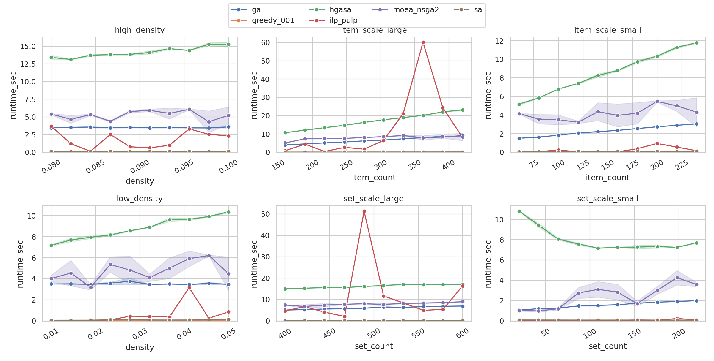
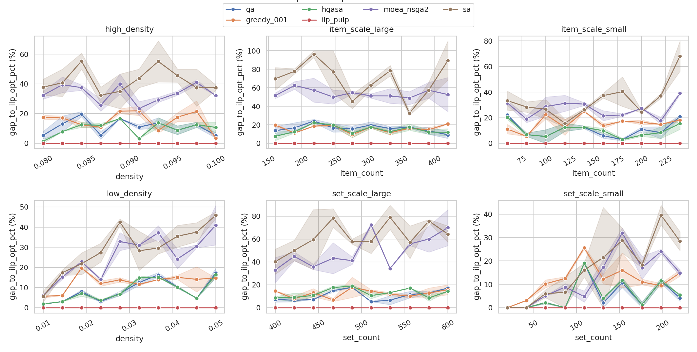

如果只看“按 class 汇总”的柱状图，很难回答“到底是规模变大导致的，还是密度/结构导致的”。因此我们把每个类别映射到一个控制轴（set-scale 看 `set_count`，item-scale 看 `item_count`，density 类看 `density`），画出随轴变化的趋势线。

从趋势图可以读出更细的结论：

- **规模效应**：`set_count` 增大时，`ga/hgasa/ilp` 的耗时上升明显；`sa` 上升相对较弱，说明 SA 的单步代价更小且更受固定迭代预算影响。
- **item 维度更敏感**：`item_count` 变化对 `ilp` 与 `hgasa` 更敏感，这与二者“需要更频繁地验证覆盖/改进下界”的代价结构一致。
- **密度改变质量格局**：低密/高密类别在质量上呈现不同优势算法（对应 4.2 的优势区间）。密度本质上改变了约束矩阵的结构：稠密时一个集合能覆盖更多元素，局部微调更有效；稀疏时可行性更脆弱，错误选择更难补救。

### 4.4 稳定性与收敛

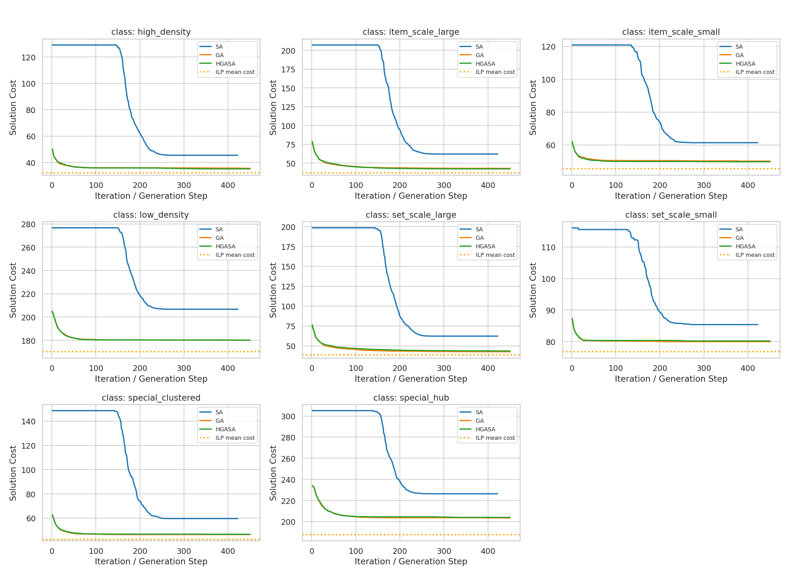
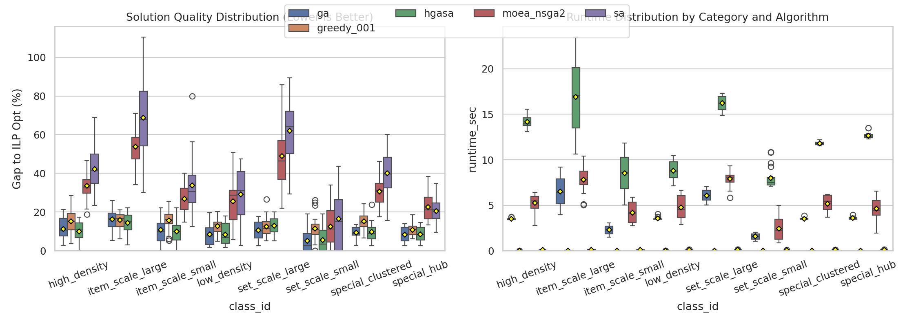

“稳定性/收敛”是元启发算法里很关键、但经常被忽略的一维：两种算法平均质量接近时，谁更稳定、谁更快到达可用解，会直接决定工程侧的用户体验。这里我们从两个角度看：

- **收敛曲线**：图中展示的是按类别汇总的平均收敛轨迹（cost 随迭代/代数下降）。
- **收敛速度与稳定性统计**：用 `convergence_speed_mean` 表示“达到最终改进 95% 所需步数”（越小越快），用 `stability_var_mean` 表示“同一实例重复运行 objective 的方差”（越小越稳）。

按 `summary_by_param.csv` 的统计结果：

| 算法 | convergence_speed_mean | stability_var_mean |
|---|---:|---:|
| moea_nsga2 | 51.9 | 10.0125 |
| ga | 89.34 | 1.3063 |
| hgasa | 97.54 | 1.5438 |
| sa | 215.16 | 26.1375 |

结合收敛曲线与统计值，可以得到更接近“工程直觉”的解读：

- `sa` 在本批次里运行极快，但收敛步数更长、且同一实例重复运行的波动更大。这类现象常见于 SA：温度 schedule 与邻域定义会决定它到底是在“快速跌到某个盆地”还是能“持续探索到更深的盆地”。
- `ga/hgasa` 的稳定性明显更好，说明在相同预算下它们更容易给出可复现的质量；这也是最终把 GA 作为主推启发式的一个重要理由（HGASA 的质量提升不稳定地抵消了额外时间开销）。

需要强调：本批次 repeats=2 时，方差估计还比较粗糙；在正式提交版（repeats≥5）下，这一部分结论会更稳。

### 4.5 显著性统计

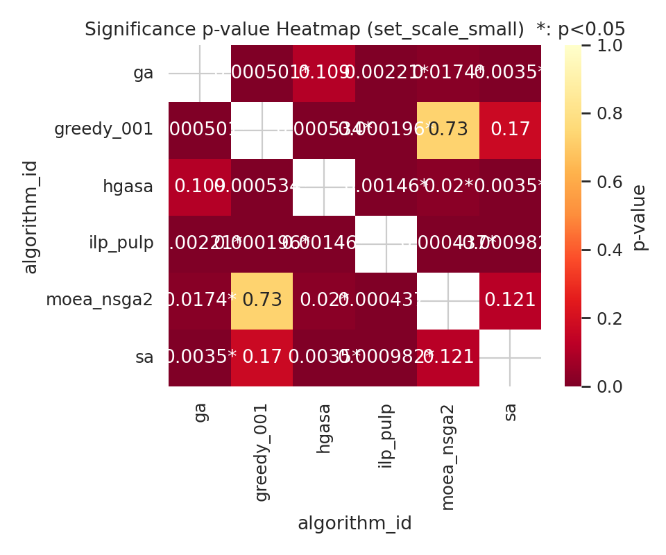
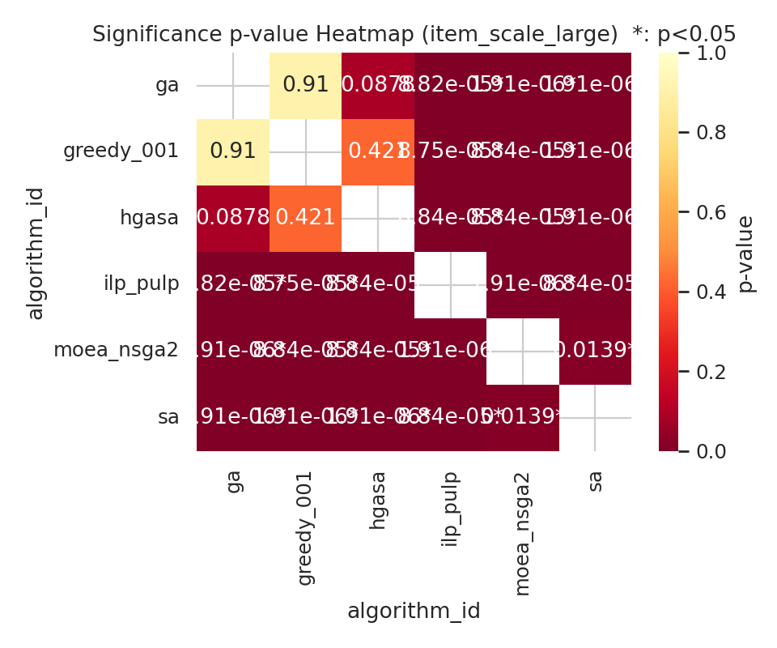

仅看均值有时会被“偶然更好”误导，因此我们补充了成对显著性检验。这里使用 Wilcoxon 符号秩检验（非参数、适合不服从正态的情况），把同一实例在不同算法下的结果配对比较。热力图中的数值是 p-value，带 `*` 表示在 $\alpha=0.05$ 下显著。

基于 Wilcoxon（$\alpha=0.05$）的统计汇总如下（以 gap 指标为主）：

- `ga` vs `hgasa`：8 类中 **0 类**达到显著差异（质量差距小，互有胜负）
- `ga` vs `sa`：8 类中 **8 类显著**
- `hgasa` vs `sa`：8 类中 **8 类显著**
- `ga`/`hgasa` vs `greedy_001`：多数类别显著（6/8）

这组结论对报告写法很关键：

- `ga` 与 `hgasa` 的差异“看得见但不显著”，意味着它们的优势区间更多来自“均值层面的细微差别”，并不稳定到可以在统计上判定“必然更好”。因此把 HGASA 作为主线算法并不划算（更慢但不显著更好），更合理的是把它放在候选分析中，主线固定 GA。
- `sa` 相对 `ga/hgasa` 的劣势则是稳定且显著的：不仅均值更差，差异在多数实例上方向一致，这也解释了为什么收敛曲线看起来“收敛很快”，但最终解质量却明显落后。

同样需要提醒：repeats 与实例数越多，显著性检验越可靠。本批次作为预实验足以支持“趋势性结论”，但正式版仍建议扩展样本量以增强说服力。

据此在最终报告主线中固定选择 `ga` 作为唯一启发式：在保持接近 `hgasa` 质量的同时，运行时间开销更低，且实现复杂度更可控。

### 4.6 理论-实验一致性（复杂度拟合）

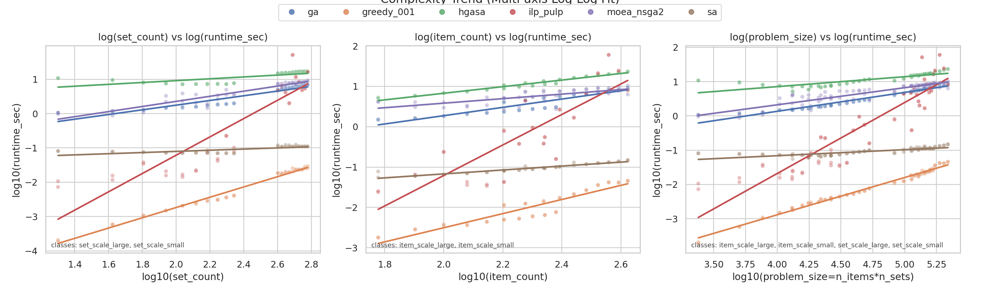

课程要求里强调“理论复杂度与实际增长趋势的一致性”。这里我们采用一个非常实用的做法：把横轴（问题规模）与纵轴（运行时间）都取对数，在 log-log 坐标下做线性拟合。此时斜率可以理解为一种“经验增长指数”：斜率越大，时间对规模越敏感。

`problem_size` 轴拟合斜率（$\log(runtime)$ vs $\log(problem\_size)$）：

| 算法 | slope | R² |
|---|---:|---:|
| sa | 0.1757 | 0.6969 |
| hgasa | 0.2895 | 0.6953 |
| moea_nsga2 | 0.4986 | 0.8521 |
| ga | 0.5512 | 0.9569 |
| greedy_001 | 1.0866 | 0.9882 |
| ilp_pulp | 2.0694 | 0.8435 |

一致性解读（把理论直觉对回实验）：

- `ilp_pulp` 斜率最大，符合精确法随规模快速变慢的预期；即使本批次规模尚可求解，趋势上仍能看出“难度上来会爆”的风险。
- `greedy_001` 的斜率接近 1 且 R² 很高，说明其时间增长更平滑、更接近单轮扫描型的规律；这也是贪心在工程上常被用作基线的原因。
- `ga/hgasa/sa` 的斜率相对较低，一方面说明它们在该规模段更“可扩展”，另一方面也提醒我们：元启发的时间往往被固定预算主导（代数/迭代上限、种群规模），因此斜率并不等价于其理论最坏复杂度，而更像“在这组预算下的经验增长”。

偏差原因：
- Python 实现常数项、缓存/向量化影响；
- 不同算法的早停与固定预算机制差异；
- ILP 求解器内部启发式/剪枝导致非平滑增长。

### 4.7 鲁棒性

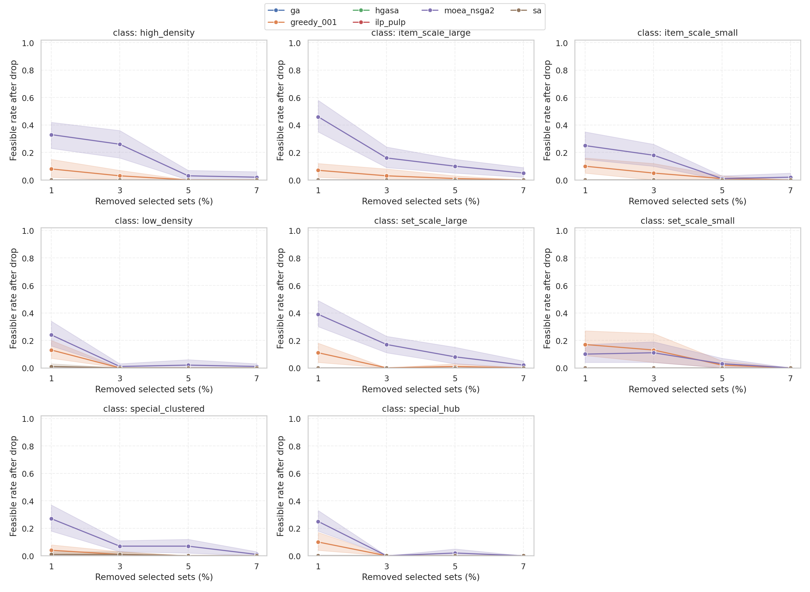

仅最小化成本会带来一个典型副作用：解往往“刚好覆盖”，冗余度低。一旦环境里发生集合失效（资源不可用、传感器掉线、任务被取消），覆盖就可能立刻变成不可行。为了把这个风险显式化，我们做了一个简单但直观的鲁棒性压力测试：

对每次运行得到的解，随机删减已选集合的 1/3/5/7%，然后检查剩余集合是否仍能覆盖所有元素，统计可行率（feasible rate）。

从曲线形态上可以看出：

- 多数算法在小删减比例（1%~3%）下可行率下降有限，说明在这批实例上仍存在一定冗余。
- 在某些类别（尤其是结构类与规模较大的类别）可行率下降更快，提示这些类别更容易出现“关键集合/关键元素”，解的稳健性更依赖冗余覆盖。

这一观察也解释了我们为什么要把 NSGA-II 单独拿出来：它不是为了在单目标成本上硬赢 GA，而是为了在“成本可接受”的前提下，把冗余度（抗损性）作为硬约束或显式目标来优化。

### 4.8 多目标补充（NSGA-II）

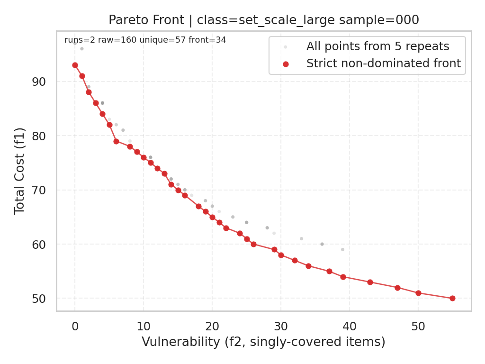

`moea_nsga2` 提供帕累托前沿统计（如 `pareto_size_mean`、`front_hv_norm_mean`），适合在“成本-脆弱性”双目标场景下使用。

这里的第二目标 `vulnerability` 在本项目中定义为“单覆盖元素数”（coverage==1 的元素数量）。它可以看作一种很便宜的抗损性代理指标：如果很多元素只被覆盖一次，那么一旦对应的关键集合失效，就会出现大面积未覆盖；反之，vulnerability 越小，通常意味着覆盖冗余越高、解更稳健（但往往也更贵）。

NSGA-II 在本报告中的推荐比较口径如下（面向业务抗损要求）：

1. 先给定抗损阈值 $\tau$（例如允许的“单覆盖元素数”上限）。  
2. 在帕累托前沿中筛选满足 `vulnerability <= τ` 的解。  
3. 在筛选后的解中取最小成本解，与 `ga/greedy/ilp` 对比。  
4. 若无解满足阈值，则选取 knee point 作为折中解。  

阈值 $\tau$ 的设定可以来自业务侧：例如你希望“即便随机失效 3% 已选集合，仍有较高概率保持可行”，那么 $\tau$ 就不应太大；或者你可以把 $\tau$ 作为一条扫描参数，画出“成本-稳健性”的可行边界曲线，给出一张更像工程决策的推荐图。

说明：当前批次统计文件中的 `moea_nsga2 objective` 仍是“可行解中最小成本代表解”（而不是按 $\tau$ 从前沿筛选的解），因此它在图中的单目标 gap 偏高。正式提交版应按上述阈值口径重算一版 NSGA 对比结果，并与第 4.7 节的删减测试做一致性验证。

---

## 5. 优势区间图/性能边界总结

### 5.1 最终算法主线

最终提交建议固定为：`ilp_pulp + greedy_001 + ga + moea_nsga2`。

- `ga`：唯一启发式主推（单目标常规方案）。
- `moea_nsga2`：只在抗损性有明确约束时启用（阈值筛选口径）。
- `sa/hgasa`：保留在“候选筛选与机理分析”部分，不放入最终主比较表。

这套主线的好处是“说得清、用得上”：

- 如果你是在离线求最优（或规模还在 ILP 可承受范围内），`ilp_pulp` 给出最强的质量基准；
- 如果你是在在线/实时系统里需要极快响应，`greedy_001` 基本是安全选项；
- 如果你希望在“秒级时间”里拿到明显更好的成本，`ga` 是更均衡的选择；
- 如果你的业务对失效风险敏感（抗损性是硬要求），就不该用单目标强行解释一切，此时 `moea_nsga2` 才有意义：它提供的是“在不同稳健性要求下，成本最低能做到多少”。

### 5.2 数据类别精简建议

若你希望减轻实验与报告负担，同时保留主要结论，建议从 8 类精简到 7 类：

- 保留：`set_scale_small`, `set_scale_large`, `item_scale_small`, `item_scale_large`, `low_density`, `high_density`, `special_hub`
- 可选删除：`special_clustered`

原因：`special_hub` 对“抗损性脆弱”问题更有解释力，`special_clustered` 与其他结构类信息有一定重叠。

### 5.3 分类推荐（按业务目标）

为了让“优势区间”更像一个可执行的结论，这里把推荐拆成四种常见目标：离线最优、在线低时延、常规单目标（本报告主推）、以及抗损性约束（阈值口径）。你在报告正文里可以直接引用这一表格作为“性能边界总结表”。

| class_id | 离线最优（质量绝对优先） | 在线低时延 | 常规单目标（最终主推） | 抗损性约束（vulnerability<=τ） |
|---|---|---|---|---|
| set_scale_small | ilp_pulp | greedy_001 | ga | ga / nsga2（二次评估） |
| set_scale_large | ilp_pulp | greedy_001 | ga | ga / nsga2（二次评估） |
| item_scale_small | ilp_pulp | greedy_001 | ga | ga / nsga2（二次评估） |
| item_scale_large | ilp_pulp | greedy_001 | ga | ga / nsga2（二次评估） |
| low_density | ilp_pulp | greedy_001 | ga | ga / nsga2（二次评估） |
| high_density | ilp_pulp | greedy_001 | ga | **nsga2优先** |
| special_hub | ilp_pulp | greedy_001 | ga | **nsga2优先** |
| special_clustered（若保留） | ilp_pulp | greedy_001 | ga | ga / nsga2（二次评估） |

注：`nsga2优先` 指按第 4.8 节阈值规则选解后再比较成本，而不是直接取最小成本代表点。

---

## 6. 总结与展望

### 6.1 核心结论

1. `ilp_pulp` 提供最优参考，且本批次 160/160 均为 `optimal`。  
2. 在候选启发式中，`GA` 与 `HGASA` 质量差异不显著，结合运行时间后，最终固定 `GA` 为唯一启发式主推。  
3. `SA` 的优势主要是速度，不是质量；与 `GA/HGASA` 的质量差异在统计上显著。  
4. `NSGA-II` 应作为“抗损性约束场景”的专用方案，按阈值选解后再做成本比较。  
5. 复杂度拟合与理论趋势总体一致，但工程实现常数与求解器机制会带来明显偏差。

### 6.2 理论与实验异同

- 一致点：ILP 随规模增大成本急升；GA 在常规单目标场景下质量-时间折中稳定。  
- 差异点：SA 在本批次“非常快但质量差”，说明实现细节（邻域代价、迭代预算）对实验结论影响极大；NSGA 若用单目标代表点会低估其抗损性价值。

### 6.3 后续改进（建议）

1. 按课程要求将随机重复提升到 `repeats>=5`（建议 5~10），提高统计置信度。  
2. 统一早停策略并做敏感性分析，避免算法间预算不对称。  
3. 将 NSGA-II 的正式评价改为“抗损阈值筛选 + 最小成本”口径，并补充 knee point 结果。  
4. 在报告主文固定 4 算法（`ilp_pulp`,`greedy_001`,`ga`,`moea_nsga2`），`sa/hgasa` 放入附录筛选分析。  
5. 若需减负可采用 7 类数据集（去掉 `special_clustered`），保留 `special_hub` 以支撑抗损性论证。  
6. 增加内存指标与能耗代理指标，形成更完整的性能边界图谱。
